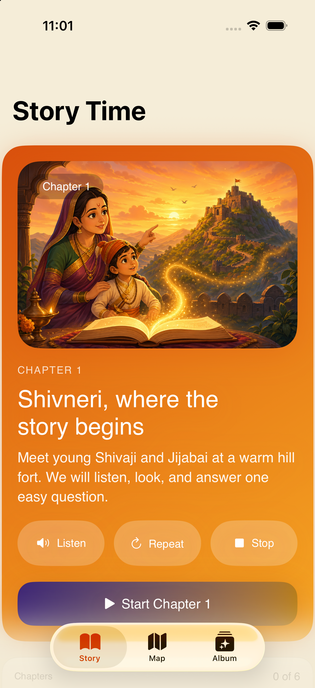
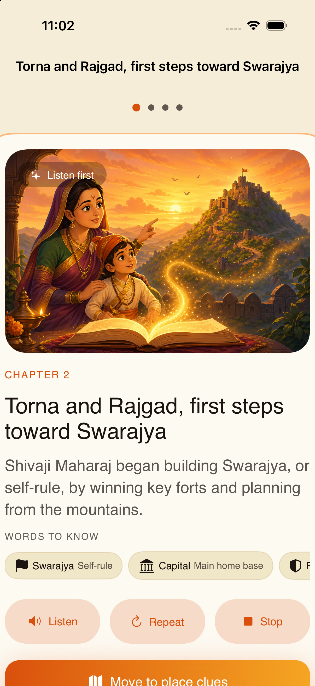
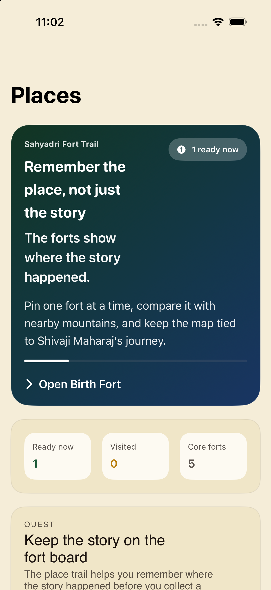
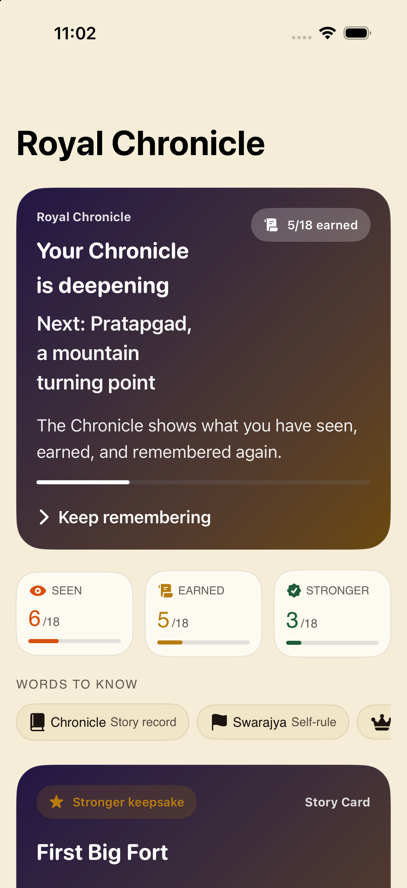
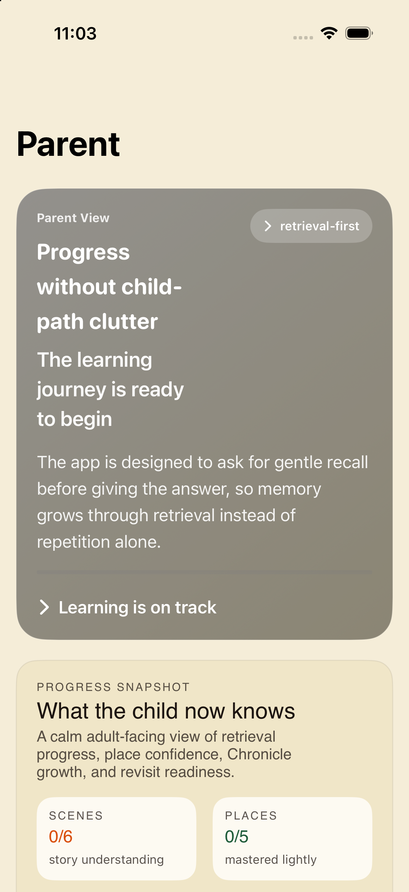

# App review and enrichment for children

Date: 2026-10-01 · Revision reviewed: `7b6f189` · Platform: iPhone 17 Pro simulator, iOS 26.5, Xcode 27.0

## Question and verdict

What is broken, weak, or unfinished, and how can Greats of Bharatha become an enjoyable learning experience for children?

The app has a promising foundation: a six-scene historical arc, warm opening art, local narration, forgiving retry logic, geographic anchors, and meaningful collectible rewards. It is currently a partially integrated learning prototype. Fixing persistence and learning correctness should precede expansion. The strongest product direction is a sequence of small story adventures in which children listen, discover, act, remember, and leave a visible mark on their own album.

## Evidence and limitations

- Built and ran the existing suite: **33 tests passed, zero failures**. Result bundle: `/tmp/gob-review-tests`; build log: `/tmp/gob-review-build.log`. These temporary files are local diagnostic outputs.
- Captured and inspected five fresh simulator screenshots, embedded below. Only the home capture is an ordinary launch. Other captures use the repository's capture routes; the Album capture deliberately seeds progress. They do not prove normal navigation or completion.
- Reproduced saved-progress destruction across normal relaunch using the app's own capture seed. Before/after preference snapshots are retained alongside the screenshots.
- Reviewed default lesson flow, experimental Learn & Quiz flow, store, content adapters, maps, parent view, design tokens, intelligence helpers, and tests.
- Native computer controls could not attach to Simulator. Therefore the interactive quiz/reward transitions were inspected in code, not tapped through. No full end-to-end visual audit is claimed. The Product Design audit skill requires: “Do not claim an audit if the actual flow could not be accessed and captured.”
- No child sessions, physical-device audio/haptics, VoiceOver traversal, iPad/landscape screenshots, offline map tests, performance profiling, or historical source verification were completed. Proposed fun improvements are hypotheses to validate.
- Existing audience documents differ: the first-character spec says 8–11; the later validation script says 6–10. Choose an initial reading level before expanding content. An implementation prompt elsewhere even refers to age five.

## Prioritized findings

### 1. P0 — Normal startup clears saved progress

`AppModel.swift:26–29` unconditionally calls `applyCaptureSeed`, defaulting to `.pristine`. `GreatsOfBharathaApp.swift` also supplies `.pristine` when no capture route exists. `ShivajiLessonStore.swift:367–402` clears mastery, resets review schedules, and persists the cleared state.

**Reproduction:** launch `chronicle-unlocked`, verify saved records for scene 1 and scene 2, terminate, launch normally, inspect the same preferences. Saved mastery changes from two records to `{}`. See `progress-before.json` and `progress-after.json` in the evidence directory.

**Impact:** earned progress and the child's reason to return disappear. **Fix:** make capture seeding explicitly opt-in, isolate capture/test storage, and add a normal-app relaunch regression test.

### 2. P1 — Quiz options expose identifiers and duplicate correct answers

`SceneLessonView.swift:72–88` builds options from all accepted answer aliases followed by raw `mapAnchors`. Those anchors are IDs, not display names (`ContentModels.swift:182`). `SimpleRecallView` renders `choice.title` directly.

Chapter 1 consequently offers **“Shivneri Fort,” “Shivneri,” and “place-shivneri”**. The first two are both correct; the ID is an artificial distractor. Chapter 2 offers “Rajgad,” “place-torna,” and “place-rajgad.” Chapter 5 starts with three equivalent correct sentences.

**Fix:** separate accepted text aliases from authored choice options; use one correct display answer and plausible, distinct distractors. Validate every chapter's choices, labels, correctness, and recovery path.

### 3. P1 — A lesson can ask for a fact it did not teach

The active story screen renders `childSafeSummary` but omits the authored learning cards, key fact, and memory anchor. The place step uses only the first place. For Chapter 2, this means a generic summary about winning forts and a Torna map, followed by **“Which fort became an early capital?”** The content contains the Rajgad explanation, but this active teaching path omits it. Glossary definitions do not supply the missing association.

**Fix:** explicitly teach each tested fact before recall. For Chapter 2 show both forts, explain Torna's early win and Rajgad's planning role, then ask a comparison question.

### 4. P1 — Experimental games do not drive persistent learning

The default flag is off (`AppModel.swift:9–13`). The alternate flag in `LearnQuizPilotData.swift` also reads UserDefaults, creating two activation rules.

In the pilot:

- Quiz and match results live in view `@State`, without store writes.
- `FlashcardReviewView.swift:225` creates a new initial schedule on every response and only retains the result in view state.
- `LearnQuizPilotData.swift:199` constructs book progress from hardcoded successful evidence. The journey entry is hardcoded as remembered again.
- The home progress is fixed at one third and “Continue” always opens Shivneri.
- The first hint is displayed even when `revealedHintCount == 0`, so the evaluator can label a visibly assisted response as unassisted.

**Fix:** retain the useful mechanics, but connect all activities to one persisted event/store model before enabling the pilot. Rewards and scheduling must derive from actual actions. Remove duplicate flags and fabricated progress.

### 5. P1 — Parent switches do not affect the app

Assist, narration, and calm-transition settings are only read/written by the Parent view. The lesson, narrator, and animation consumers never read them; settings also reset with the in-memory AppModel.

**Fix:** persist settings and apply each to the relevant behavior. Verify by changing a setting and observing narration/help/motion, then relaunching. A test that only checks the Boolean changed is insufficient.

### 6. P1 — The map promises mastery without a mastery action

The map hub invites children to pin forts and shows a “Visited” mastery count. `GBFortMapView` celebrates a pin tap without recording evidence. The explorer reveals any tapped fort and retains that state locally. `PlaceDetailView` has no learning-store write. There is no active place-placement assessment to support the mastery claims.

**Fix:** distinguish exploration from demonstrated learning. Add a forgiving “find the fort from this clue” interaction, a tap alternative to dragging, a check against the intended target, and persistent place evidence. Keep free exploration available.

### 7. P2 — Progress language overstates what was demonstrated

Home chapter cards use any non-nil mastery as the basis for a completed accessibility label/checkmark, even though merely opening a lesson records `.witnessed`. Album enrichment is inferred from a fixed mastery threshold, while copy says the child “remembered again.” Some first-time correct answers already award higher mastery. The store advances schedules for any successful outcome without distinguishing hint use; its more nuanced standalone scheduler is not used by the default flow.

**Fix:** show “Started” for exposure, “Completed” for demonstrated recall, and “Remembered again” only for a distinct revisit. Feed hint-assisted, rescued, and independent recall into scheduling explicitly. Parent summaries should report observed activity rather than broad knowledge claims.

### 8. P2 — Repeated art and weak continuation flatten the adventure

Every chapter uses `Image("Chapter1ShivneriStory")` (`SceneLessonView.swift:201`), including later adult events. Home always features Chapter 1; the reward screen offers Album but no direct next-chapter action. Leaving a lesson loses its phase because it is local view state.

**Fix:** add scene-specific illustrations and a saved resume point. Make the primary home action the next useful activity. End each chapter with a satisfying stopping point, the earned object, and a clear optional next adventure.

### 9. P2 — Accessibility, localization, and offline behavior need completion

The place and quiz phases use fixed-height content inside non-scrolling stacks, which is a clipping risk on small screens, landscape, and large text. Some typography helpers cap Dynamic Type. Motion preferences are respected in a few components but not consistently across lesson transitions and map animations. Custom font names are referenced, but no font files were found in the repository. No string catalog/localized string files were found; narration chooses English voices. Maps depend on MapKit, with no explicit bundled offline learning map.

**Fix:** use scalable text, scrollable compact layouts, visible focus/feedback, and consistent Reduce Motion behavior; bundle/register intended fonts or intentionally use system fonts. Add authored Marathi/Hindi content and pronunciation review after choosing the initial audience. Ship a lightweight illustrated offline fort board alongside the optional live map. These are readiness gaps; exact clipping, contrast ratios, battery use, and offline behavior still require device testing.

### 10. P2 — Adult-only wording is not an adult gate

The “Grown-up map option” directly opens Apple Maps (`PlacesHubView.swift:242–254`). If distributed in the Kids category, external-app link-outs need a parental gate. Apple explicitly includes links to other apps in its guidance. See [Apple: safe and age-appropriate experiences](https://developer.apple.com/kids/).

**Fix:** put external handoffs in a genuinely parent-gated area. This is an observed link-out path, not a completed App Store compliance assessment.

### 11. P2 — Automated coverage misses integration behavior

The 33 tests provide useful content and engine checks, but some merely search source strings. There is no UI-test target in `project.yml`, and no AppModel relaunch test protecting the persistence boundary. The default and experimental paths implement overlapping learning rules. Timeline exists in source/capture routes but has no tab in the normal three-tab shell. AI hint/evaluator helpers have no call sites elsewhere in the app.

**Fix:** prioritize integration coverage for relaunch persistence, all six quiz option sets, teaching-before-testing, retry → reward → next chapter, settings effects, and game → store → Album consistency. Treat unused timeline/AI capabilities as unfinished until integrated and tested.

## Captured screens and flow health

These are current-run screen snapshots, not a claim that every transition was exercised.

### Step 1 — Home: promising, continuation needs work

Warm art makes a strong invitation. Three narration buttons compete with the start action, which sits near the bottom of this viewport. Chapter 1 dominates even after completion. Prefer one prominent Start/Continue action and one understandable audio control.

### Step 2 — Chapter story: content and visual mismatch

The Chapter 2 screenshot shows childhood art under the Torna/Rajgad title. The important fact is missing from the story paragraph, and continuing requires reaching the lower content. The page is scrollable; the crop does not prove an inaccessible button.

### Step 3 — Map hub: reading-heavy entry

Most of the first viewport explains the map rather than showing geography. Lead with an actual fort board and one spoken clue. The current mastery mechanics are incomplete as detailed above.

### Step 4 — Album: meaningful premise, rewards buried

The seeded Album starts with a large explanation and three progress categories before the keepsake. Put the newest collectible and a small interactive album scene first. Capture values are test data, not real child achievement.

### Step 5 — Parent: useful separation, weak trustworthiness

The screenshot's large hero contains implementation language such as “child-path clutter.” Replace it with a short factual summary, suggested conversation prompt, and functional preferences. Contrast of the white-on-gray area needs measurement; this screenshot alone does not establish compliance.

### Step 6 — Quiz, reward transition, and return visit: partially verified

Quiz and reward transition were reviewed in code; native control attachment prevented an interactive walkthrough. Relaunch persistence was independently reproduced through simulator launch and stored-preference inspection. Audio quality and child comprehension remain unverified.

## Enrichment proposal

Preserve the repository's calm mastery approach: no points, streak pressure, countdowns, or penalties. Build enjoyment through curiosity, agency, tangible creation, and story payoff.

| Opportunity | Proposed activity | Learning purpose |
|---|---|---|
| Interactive story | Tap three illustrated details; hear a short explanation | Observe the place and connect words with images |
| Fort detective | Follow one clue and choose among two or three forts | Retrieve location knowledge |
| Pair explorer | Match a fort with its role, with narrated hints | Distinguish Torna from Rajgad |
| Story sequence | Arrange three illustrated moments; tap-to-place alternative | Understand chronology and cause |
| Thoughtful choices | Choose a planning action and see its consequence | Explore leadership and reasoning |
| Living album | Place an earned keepsake into a growing scene | Make learning progress concrete and personal |
| Family retelling | “Tell someone why this fort mattered” | Encourage explanation beyond recognition |

Label imagined learning scenarios clearly so fictional choices do not become historical claims. Keep approved narration and facts as the core; optional AI should not determine historical truth or reward eligibility.

**First playable slice: “Discover Shivneri.”** Aim for an approximately 3–5 minute session, with no timer displayed:

1. A short narrated welcome with captions and replay.
2. Explore a chapter-specific scene: tap the hill, fort gate, and storybook for authored clues.
3. Hear the key fact explicitly, then find Shivneri on a simplified board.
4. Answer one well-authored recall question. A mistaken answer teaches and invites another try.
5. Place the Birth Fort keepsake in the album; see a small optional celebration.
6. Choose “All done” or a preview of Torna and Rajgad. Resume correctly after relaunch.

For less confident readers, use picture choices and complete audio support through quizzes and rewards. For stronger readers, offer an optional “Why?” question. These can be support modes without collecting a child's birth date.

Apple recommends adjustable type, motion, and sound for games; use those controls to support the richer interactions rather than making animation or audio essential. Sources: [Designing for games](https://developer.apple.com/design/human-interface-guidelines/designing-for-games/), [Accessibility](https://developer.apple.com/design/human-interface-guidelines/accessibility).

## Delivery order and acceptance

1. **Restore trust:** fix startup seeding, quiz choices, missing teaching, settings, and evidence semantics. Gate: progress survives relaunch, every question was taught, no internal IDs reach children, and each setting has a tested visible effect.
2. **Complete one delightful chapter:** build the Shivneri slice above, with original scene art, coherent audio, a real map task, and an album interaction. Gate: a child can finish and choose a stopping point with minimal adult explanation.
3. **Integrate and expand:** connect match/review/book to the shared store, then enrich the remaining five chapters. Gate: all activities update the same progress and scheduled reviews survive relaunch.
4. **Validate readiness:** use the existing child/parent validation script with age and reading-level cohorts. Observe independent starts, confusing taps, help requests, retry behavior, voluntary replay, immediate recall, and later recall. Ask parents what they think the child learned. These are proposed observations, not measured results.

Run accessibility and layout checks on a small phone, iPad, landscape, largest supported text, VoiceOver, Reduce Motion, and interrupted narration. Test core completion offline, storage migration/recovery, background/resume, repeated sessions, memory, and energy on real hardware. The current simulator debug app is about 11 MB, but that is not a release-download estimate or performance result.

## Repository references and tracking

- `GreatsOfBharatha/App/ContentView.swift`, `GreatsOfBharathaApp.swift`
- `GreatsOfBharatha/Shared/Models/AppModel.swift`, `ShivajiLessonStore.swift`, `SampleContent.swift`, `LearningEngines.swift`
- `GreatsOfBharatha/Features/Lesson/SceneLessonView.swift`, `LessonHomeView.swift`
- `GreatsOfBharatha/Features/LearnQuiz/`, `Features/Map/`, `Features/Parent/`, `Features/Chronicle/`
- `docs/specs/2026-04-12-shivaji-maharaj-first-character-spec.md`
- `docs/research/2026-04-30-shivaji-learn-quiz-child-parent-validation-script.md`

Linked issues: none created during this review. Findings are numbered so they can be converted into discrete implementation issues. This change adds review documentation and evidence only.
