# Multi-agent app repair and TestFlight delivery plan

Date: 2026-10-01 (India time) · Baseline: `7b6f189` · Status: implementation complete; integration validation and publication in progress

Source review: [App review and kids enrichment](../research/2026-10-01-app-review-and-kids-enrichment.md). Linked issue: [Kids app readiness #149](https://github.com/ganesh47/greatsofbharatha/issues/149).

## Outcome

Deliver a trustworthy, child-friendly Shivaji learning experience through two implementation milestones in the 0.2.0 TestFlight beta. Milestone A repairs the default six-chapter journey. Milestone B connects the richer activities and delivers a playable “Discover Shivneri” chapter. Each publication must be tied to an exact tested commit and verified in the intended TestFlight group.

This plan was prepared by three specialist agents and a lead integrator, using source inspection and live GitHub release checks. The previous review's 33 passing simulator tests establish the baseline, not release acceptance. Some older findings in #149 describe code that has since changed; use the current source and current-run evidence when implementing.

## Confirmed release state and prerequisites

| Item | Verified state | Next action |
|---|---|---|
| Apple API access | Agreement blocker cleared: Oct 1 feedback-sync attempt 2 succeeded and fetched 25 screenshot feedback items | Recheck the specific Cloud/distribution API permissions during release preflight |
| GitHub Release workflow | Creates a GitHub release only | Add actual distribution orchestration; do not treat a release/tag as upload proof |
| Xcode Cloud | Post-clone bootstrap exists in repository | Inspect the real Cloud repository connection, workflow, signing, Archive action, and TestFlight post-action |
| Credentials | Four App Store Connect secret names exist at repository level | Verify app/key/team permissions through safe CI checks; never print key material |
| Versioning | Project defaults to `0.1.0-dev` and build `1`; bootstrap stamps tag and Cloud build number | Validate numeric marketing version and unique build number before archive |
| Build verification | Poller compares build number with marketing-version input | Replace with exact app + marketing version + build number and group checks |
| Remote gates | No main branch protection/rulesets or release environment protection were found | Enforce exact-commit checks within release orchestration; propose remote required-check configuration separately |

Agreement history: [feedback sync run](https://github.com/ganesh47/greatsofbharatha/actions/runs/36869804687) initially failed with `403 FORBIDDEN.REQUIRED_AGREEMENTS_MISSING_OR_EXPIRED`. After the user reported accepting the agreement, attempt 2 succeeded at approximately 23:25 India time on Oct 1 and fetched 25 screenshot feedback items, matching 25 existing issue markers. The agreement/API blocker is resolved for this operation. No archive/upload was attempted; signing permissions and Cloud distribution access remain separate preflight checks. Signing the agreement was a human Account Holder action.

Latest observed GitHub release: [v0.1.13](https://github.com/ganesh47/greatsofbharatha/releases/tag/v0.1.13). Do not allocate the next version until checking App Store Connect build history. A successful GitHub release does not establish the latest TestFlight version.

## Team and file ownership

Use four concurrent slots: three implementation agents plus the lead. Work in the shared integration branch with exclusive file ownership, starting from the same verified baseline. Agents return changes and evidence to the lead; integration, shared-project generation, and publication are sequential.

| Agent | Responsibility | Exclusive edit ownership |
|---|---|---|
| State and reliability | Persistence, evidence, scheduling, settings storage, observation, resume APIs | `AppModel.swift`, `ShivajiLessonStore.swift`, `LearningEngines.swift`, `HeroArcModels.swift`, `MasteryState.swift`, app startup/capture routes, new state/integration tests |
| Learning and play | Authored quiz choices, teaching content, child journey, audio/help/motion consumers, map task, Album presentation, pilot integration | `SampleContent.swift`, `ContentModels.swift`, lesson/home/map/Chronicle/Parent/LearnQuiz views, relevant design components, new content tests |
| Release and verification | CI checks, Xcode Cloud delivery, exact build verification | `.github/workflows/`, `ci_scripts/`, release validation tests |
| Lead integrator | Resolve contracts, UI-test harness, project generation, review, merge, acceptance evidence, release and handoff | `project.yml`, generated project/scheme, UI tests, app shell, plan/tracker documents; agreed integration fixes |

Only the lead regenerates the project while agents are working. A source owner requests model or project changes from the owner rather than editing shared files concurrently. After implementation, reuse a freed agent slot for independent regression/release review.

## Wave 0 — Agree contracts and establish the release path

Before feature edits, agree these interfaces:

1. Optional explicit capture profile, isolated capture/test storage, and injected persistence. Normal startup must only load real progress.
2. A typed learning result containing stable subject/activity IDs, correctness, help used, timestamp, and idempotent event/attempt ID. Separate exposure, initial recall, place learning, and later review.
3. Canonical scene/place/reward IDs. Pilot IDs currently begin `reset-scene-*` and `reset-reward-*`; either map them explicitly to canonical content or register them in a generalized content registry. Do not silently write pilot IDs into the current fixed store.
4. Scheduling granularity: stable per-card IDs for distinct recall cards; any scene-level aggregate is derived. Preserve legacy scene schedules during migration rather than merging unrelated cards silently.
5. Settings behavior: narration off stops current speech; system Reduce Motion and calm mode reduce motion; assistance offers extra scaffolding while retaining supportive retry teaching.
6. Persisted current lesson/phase and meaningful Home continuation. Store observation updates Home, Map, Album, and Parent immediately.

Parallel preflight: confirm the simulator baseline, inspect Cloud configuration, confirm intended tester group, and identify the first release's exact version/build allocation. The Apple agreement can be resolved while app repair continues.

## Milestone A — Reliable default six-chapter beta

Keep the experimental learning reset disabled until its contracts are integrated.

| Task | Owner | Dependencies | Acceptance |
|---|---|---|---|
| A1 Preserve progress and isolate capture data | State | Wave 0 | Normal relaunch preserves mastery, rewards, settings, schedules, and resume; capture routes never overwrite real data |
| A2 Correct evidence and scheduling | State | A1 | Exposure/wrong answers/duplicate callbacks do not advance completion or review intervals; hinted/rescued answers schedule differently; only a distinct revisit earns “remembered again” |
| A3 Observe live store changes and persist settings | State + Learning | A1, agreed APIs | Unlocks update immediately; settings survive relaunch and change actual behavior; completed narration clears active playback state |
| A4 Author sound quiz choices and teach every assessed fact | Learning | Choice/content contract | Every chapter has distinct child-readable labels, one correct displayed option, plausible distractors, no raw IDs, and explicit teaching of its tested answer |
| A5 Resume and progression | Learning | A1–A3 | Home opens the next useful activity; exposure displays “Started”; reward provides an optional next chapter; exiting/resuming restores the journey |
| A6 Add a real place challenge | Learning | A2 | Exploration remains separate from assessment; finding the intended fort records location evidence; scene recall alone never implies place mastery |
| A7 Accessible and child-safe completion | Learning + Release | A3–A6 | Compact/landscape layouts scroll; text scales; Reduce Motion works; quizzes/rewards have audio support; Apple Maps link-out is in a parent-gated area |
| A8 Release pipeline and exact verification | Release | Wave 0; final tested SHA | CI gates, Cloud archive/upload, correct version/build lookup, and intended tester-group availability are verified |

For artwork, never reuse the Chapter 1 childhood illustration as if it depicts adult chapters. Use appropriate existing approved assets where available; commission missing scene art as a scoped asset task. Do not fabricate placeholders and call them finished art.

Preserve legacy achievements during migration. Corrupt schedule data must not erase intact mastery. The nested `ObservableObject` notification concern is code-derived and needs a UI regression test before choosing the final observation approach.

## Milestone B — Connected games and a delightful Shivneri adventure

Start after A's state/content APIs stabilize. Avoid enabling the pilot simply by adding callbacks: its book progress is currently fabricated, its IDs differ, and its schedules reset per response.

1. Consolidate feature flags; map canonical IDs; route quiz, matching, flashcard, and map outcomes into the shared store. Album and Parent read actual events.
2. Remove hardcoded successful evidence, remembered journey state, fixed one-third Home progress, and first-scene-only Continue behavior.
3. Reveal hints only when requested or earned through retry, and record assistance faithfully.
4. Build “Discover Shivneri”: short captioned narration → tap three illustrated details → hear the birth-place fact → find Shivneri → gentle recall → place a Birth Fort keepsake in a growing album → choose All done or next adventure.
5. Keep tap alternatives for dragging and make audio/motion optional. Clearly label imagined planning scenarios so fictional choices do not become historical claims.
6. Add a simple offline learning board; live MapKit remains an optional geographic view. Then expand proven mechanics to the other chapters and add authored/localized narration as separate content work.

Keep the existing no points, streaks, timers, or punitive wrong-answer feedback constraints. A companion character, sound polish, and additional animation are optional follow-ups after child validation. Use the app's existing visual system and actual scene art as the initial design reference.

## Validation gates

Meaningful automation must cover:

- Complete Chapter 1 through production APIs, destroy/recreate AppModel with the same isolated persistence, and verify progress, unlocks, next chapter, schedule, settings, and resume.
- Capture profile cannot mutate normal storage; legacy records migrate; repeated events are idempotent.
- Wrong recall does not complete a scene or unlock a reward; independent/hinted/rescued responses produce appropriate distinct scheduling.
- Every assessed fact appears in the teaching path, and all six chapters have one correct displayed answer and no internal IDs.
- Quiz → store → Home/Album/Parent updates without relaunch; place mastery requires place evidence.
- UI journey: wrong answer → gentle retry → correct answer → reward → next chapter → terminate/relaunch.
- Preferences change actual narrator/help/transition behavior, including active-speech stop and system Reduce Motion.
- Pilot match/review results survive relaunch; no fabricated rewards or fresh schedule on each response.
- Release verifier distinguishes marketing version from build number, paginates where needed, handles terminal API/build failure, rejects expired/wrong builds, and checks the expected group association.

Acceptance evidence also requires small-phone and iPad layouts, landscape, large text, VoiceOver task completion, Reduce Motion, offline core completion, interrupted narration, and a real-device beta smoke test. Do not infer performance or audio quality from a simulator build. Use the existing child/parent script for comprehension, confusion, voluntary replay, and immediate/later recall. Child sessions are planned validation, not an automated CI claim.

## CI/CD publication design

Prefer GitHub checks plus the existing Xcode Cloud direction, **after verifying an actual Cloud distribution workflow exists**. Apple documents Archive and a TestFlight post-action as the distribution path: [Cloud TestFlight distribution](https://developer.apple.com/documentation/xcode/distributing-your-xcode-cloud-builds-through-testflight), [workflow actions](https://developer.apple.com/documentation/xcode/configuring-your-xcode-cloud-workflow-s-actions).

```mermaid
flowchart LR
    A[Agent branches and PRs] --> B[Build, tests, content checks, UI evidence]
    B --> C[Integrate and validate exact commit]
    C --> D[Release preflight and version allocation]
    D --> E[Immutable release tag]
    E --> F[Xcode Cloud test and signed archive]
    F --> G[App Store Connect upload and processing]
    G --> H[Exact version/build and beta group verification]
    H --> I[Real-device TestFlight smoke test]
```

Implement the following release stages:

1. **Preflight:** validate tag format, source SHA, app/bundle/team identity, numeric version, unused build identity, working API access, selected Cloud workflow, and existing internal group. Fail immediately on the agreement error rather than polling for an hour.
2. **Exact-commit gates:** require the tested commit's app build/unit/integration/content/UI checks, relevant lint/security/dependency checks, and XcodeGen consistency. Screenshots must be present and usable; the current post-merge best-effort capture is not enough. Avoid requiring a skipped path-filtered check indiscriminately.
3. **Trigger once:** create/use a tag on the validated commit and start one verified Cloud distribution workflow. Choose tag-start or explicit API dispatch, not both. Serialize releases and retain a run/commit mapping so retrying verification does not create duplicate uploads. Repository Release may publish notes, but it is not the distribution gate.
4. **Stamp:** validate `CI_TAG` before generating the project; use a numeric marketing version and a unique Cloud build number. Ensure capture routes/seeds cannot activate in distribution builds.
5. **Archive/upload:** build/test/analyze/archive with the verified SDK and Apple-managed signing; configure the internal TestFlight group post-action. If Cloud is unavailable, design a separately scoped GitHub macOS signing/upload workflow with actual credentials and profile verification before switching paths.
6. **Verify:** query the expected app, linked pre-release marketing version, build number, processing state, expiration, and beta-group association. Record the App Store Connect build ID and tie it to the Cloud run's exact source SHA. `VALID` alone does not establish tester availability.
7. **Distribute and smoke-test:** confirm the intended internal testers can see the build and install it. For external family testing, use the intended external group and complete required beta review/metadata steps; do not invite new testers implicitly.
8. **Release record:** save tag, source SHA, marketing version, build number, Cloud/GitHub run links, build ID, tester group, test/screenshot evidence, beta notes, and device smoke-test result. Only then mark publication complete.

Apple agreement guidance: [Account Holder roles](https://developer.apple.com/help/account/access/roles), [sign/update agreements](https://developer.apple.com/help/app-store-connect/manage-agreements/sign-and-update-agreements/). The API error does not identify which specific agreement is pending; the Account Holder must inspect the account.

## Recovery and handoff

If any app or CI gate fails, repair the same candidate and rerun relevant checks. If archive/upload fails, classify agreement/signing/version/transient failure before retrying. If an uploaded build is defective, stop expanding its tester distribution and release a corrected build with a new build number; preserve the last known-good beta and persisted-data compatibility. Do not retag an already published release.

Hand off each agent package with changed files, contract changes, validation evidence, remaining risks, and PR/run links. The lead reviews the final combined behavior, not just independently green agent branches.

## Current completion status

The user authorized implementation, multi-agent execution, merge, and TestFlight delivery on Oct 2. All three agents implemented their owned packages in `codex/kids-learning-testflight`; the lead integrates and publishes them.

- State reliability: atomic versioned snapshots with legacy recovery, isolated debug capture and test storage, persisted settings and checkpoints, live observation, idempotent evidence, distinct recall/place/review semantics.
- Child learning: six authored single-correct choices, taught facts, distinct chapter illustrations, Shivneri discovery details, offline fort clue boards, gentle retries, keepsake placement, next chapter and resume.
- Connected activities: canonical six-chapter IDs, real matching/review/book progress, persisted activity checkpoints, accessible optional read-aloud and motion settings, gated parent settings and external Maps.
- Release infrastructure: numeric version stamping, exact main-SHA checks, auto-tag Cloud run reuse, terminal-aware polling, exact App Store Connect build and existing internal-group verification, sanitized evidence artifacts.
- Preflight: Apple agreement cleared; Cloud workflow `Default` is enabled and connected to the correct repository, with an existing signed internal Archive action. Existing group: `GoB - Internal Testing`. Latest observed version before this release: `0.1.13 (16)`; target: `0.2.0`.
- Integration: running all state/content/unit and full UI tests; lint and pipeline fixtures checked locally. Final CI, merge, Cloud archive, and tester availability evidence will be recorded in the release report.
- Device installation, VoiceOver listening, actual offline network disconnection, and child/parent sessions require human validation; simulator automation is not evidence for those claims.

Illustration provenance and full prompts: [art manifest](../design/2026-10-02-chapter-illustration-prompts.json). These are interpreted story illustrations, not documented reconstructions.
